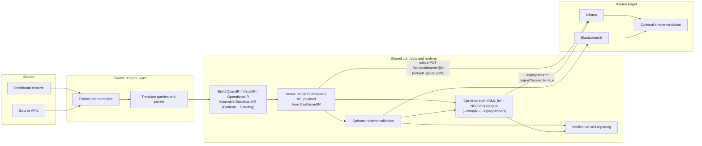

# Observability Migration Architecture

This is the repo-level architecture overview. Use it as the entry point for the
current package layout, runtime surfaces, and contributor reading order.

For the docs index, read `docs/README.md`. For the shared pipeline overview,
read `docs/pipeline-trace.md`. For source-specific traces, read
`docs/sources/grafana-trace.md` and `docs/sources/datadog-trace.md`. For the
canonical asset contracts, read `docs/architecture/asset-model.md`.

## Design Principles

1. **Source adapters in, shared target runtime out.**
2. Raw vendor JSON stays in adapter packages; shared code consumes typed contracts and result objects.
3. Query translation should stay deterministic by default, with rule packs and plugins extending behavior cleanly.
4. Validation, reporting, and runtime evidence should make semantic risk explicit instead of hiding it.
5. The current target is Kibana, but the source/target boundaries are kept explicit for future extension.

## Naming And Runtime Surfaces

The repo uses three related names:

- **Product / docs name**: Observability Migration Platform
- **Installable distribution**: `elastic-observability-migration`
- **Importable Python package**: `observability_migration`

Current runtime surfaces:

| Surface | Entry point | Purpose |
|---|---|---|
| Unified CLI | `.venv/bin/obs-migrate` or `python -m observability_migration` | Source-agnostic CLI with `migrate`, `compile`, `upload`, `cluster`, `verify`, `compare`, `schema-report`, `audit-rules`, `verify-alert-rules`, `seed-sample-data`, `remove-sample-data`, `metric-map`, `list-samples`, and `extensions` subcommands |
| Grafana CLI | `.venv/bin/grafana-migrate` or `python -m observability_migration.adapters.source.grafana.cli` | Full Grafana migration pipeline |
| Datadog CLI | `.venv/bin/datadog-migrate` or `python -m observability_migration.adapters.source.datadog.cli` | Datadog extraction, preflight, translation, report, and optional compile |
| Grafana smoke validator | `.venv/bin/grafana-validate-uploaded` or `python -m observability_migration.adapters.source.grafana.validate_uploaded_dashboards` | Post-upload Kibana saved-object validation |
| Grafana corpus generator | `.venv/bin/grafana-generate-corpus` or `python -m observability_migration.adapters.source.grafana.corpus` | Synthetic metrics/log generation for validation gaps |

## Current Target Model

The repo can run against any Elasticsearch + Kibana pair, but the main target
is Elastic Serverless.

That changes the preferred Grafana translation branch:

- compatible PromQL panels always use native `PROMQL`; when `--es-url` is
  configured, target capability detection downgrades to ES|QL translation only
  when the `PROMQL` command is *confirmed* unsupported. An inconclusive probe
  (transport/auth error) keeps native `PROMQL` — the optimistic default — and
  warns. `--translation-mode {auto,native,esql}` exists for explicit operator
  overrides; `auto` remains the normal path
- LogQL panels still translate to ES|QL against the configured logs index
- source-native ES|QL can be reused directly
- the local OTLP lab is a repeatable stand-in for local development and CI, not the primary production target

## End-To-End Flow



Generated artifacts typically include:

- `dashboards/native/<stem>.native.json` — exact typed Dashboards API payload (written unconditionally every run)
- `dashboards/ir/<stem>.ir.json` — semantic `DashboardIR` export (written unconditionally every run)
- `dashboards/native/index.json` — index over every native artifact in the run
- `dashboards/compiled/<stem>/compiled_dashboards.ndjson` — NDJSON (only when `--compile` is passed)
- `migration_report.json`
- `migration_manifest.json`
- `rollout_plan.json`
- `verification_packets.json` for Grafana and Datadog runs
- `preflight_report.json` and `required_target_contract.json` in Grafana preflight mode
- `target_readiness_contract.json` in Datadog preflight mode
- `upload_smoke_report.json` or `uploaded_dashboard_smoke_report.json` from smoke validation

## Package Map

| Path | Responsibility |
|---|---|
| `observability_migration/app/cli.py` | Unified CLI bootstrap and source dispatch |
| `observability_migration/adapters/source/grafana/adapter.py` | Registers the Grafana source adapter |
| `observability_migration/adapters/source/grafana/cli.py` | Grafana end-to-end orchestration |
| `observability_migration/adapters/source/grafana/extract.py` | Grafana file/API extraction |
| `observability_migration/adapters/source/grafana/panels.py` | Panel and dashboard translation, layout normalization, and `DashboardIR` construction |
| `observability_migration/adapters/source/grafana/translate.py` | PromQL / LogQL translation entry points |
| `observability_migration/adapters/source/grafana/promql.py` | PromQL parsing and planning helpers |
| `observability_migration/adapters/source/grafana/rules.py` | Rule registries, rule packs, plugins |
| `observability_migration/adapters/source/grafana/schema.py` | Elasticsearch field resolution |
| `observability_migration/adapters/source/grafana/esql_validate.py` | Target-side query validation and safe rewrites |
| `observability_migration/adapters/source/grafana/preflight.py` | Readiness checks and preflight report generation |
| `observability_migration/adapters/source/grafana/verification.py` | Verification packets and semantic gates |
| `observability_migration/adapters/source/grafana/smoke.py` | Post-upload saved-object validation and browser audit |
| `observability_migration/adapters/source/grafana/corpus.py` | Synthetic corpus generation |
| `observability_migration/adapters/source/datadog/adapter.py` | Registers the Datadog source adapter |
| `observability_migration/adapters/source/datadog/cli.py` | Datadog orchestration and reporting |
| `observability_migration/adapters/source/datadog/normalize.py` | Normalized Datadog dashboard shape |
| `observability_migration/adapters/source/datadog/planner.py` | Widget planning |
| `observability_migration/adapters/source/datadog/query_parser.py` and `log_parser.py` | Datadog metric/log parsing |
| `observability_migration/adapters/source/datadog/translate.py` | Widget translation |
| `observability_migration/adapters/source/datadog/generate.py` | Dashboard artifact emission: assemble `DashboardIR`, then derive the native Dashboards API payload (plus the in-memory kb-dashboard YAML document) from it |
| `observability_migration/adapters/source/datadog/curated_packs/` | Bundled per-dashboard curated Kibana **layout** packs, matched by dashboard title and applied by `generate.py` after the generic layout passes (`docs/design/curated-dashboard-packs.md#datadog-curated-layout-packs`) |
| `observability_migration/adapters/source/datadog/field_map.py` | Built-in field profiles and custom profile loading |
| `observability_migration/adapters/source/datadog/execution.py` | Live Datadog metric source execution for verification |
| `observability_migration/adapters/source/datadog/manifest.py` and `rollout.py` | Datadog manifest and rollout artifacts |
| `observability_migration/core/assets/` | Canonical asset contracts such as `DashboardIR`, `PanelIR`, `QueryIR`, `VisualIR`, and `OperationalIR` |
| `observability_migration/core/interfaces/` | Source/target adapter ABCs and registries |
| `observability_migration/core/reporting/report.py` | Shared result dataclasses and report helpers |
| `observability_migration/core/verification/comparators.py` | Comparator helpers and verification support types |
| `observability_migration/targets/kibana/emit/` | Shared Kibana YAML emission helpers |
| `observability_migration/targets/kibana/native_artifacts.py` | Writes `native/*.native.json`, `ir/*.ir.json`, and `native/index.json` — the primary Dashboard-as-Code review artifacts, unconditional on every dashboard run |
| `observability_migration/targets/kibana/dashboards_api.py` | Typed Kibana Dashboards API (`PUT /api/dashboards/{id}`) — default upload path |
| `observability_migration/targets/kibana/compile.py` | Shared compile, upload, lint, layout-validation, post-validation IR-sync, and (scratch) YAML-render helpers |

## Architecture By Layer

### Unified CLI And Adapter Registry

`observability_migration/app/cli.py` is the source-agnostic entry point. It
imports the registered adapters, exposes `migrate`, `compile`, `upload`,
`cluster`, `verify`, `compare`, `schema-report`, `audit-rules`,
`verify-alert-rules`, `seed-sample-data`, `remove-sample-data`, `metric-map`,
`list-samples`, and `extensions`, and dispatches to the dedicated Grafana or
Datadog workflows.

For live extraction, unified `migrate --input-mode api` dispatches into the
source-specific API extractors. Asset selection is controlled with `--assets`
(`dashboards`, `alerts`, or `all`).

### Source Adapters

Grafana is the most complete source path today. It owns:

- extraction from files and the Grafana API for dashboard documents
- PromQL / LogQL translation
- variable/control translation
- derived reviewer artifacts for links, annotations, transformations, and legacy alerts from dashboard JSON
- preflight readiness checks
- verification packets and semantic gates
- optional upload and post-upload smoke validation

Datadog currently covers:

- extraction from files and the Datadog API for dashboard objects
- dashboard normalization
- metric-query, formula, and log-search translation
- IR-first dashboard emission (`DashboardIR` → native payload) plus manifest and rollout outputs
- capability-aware preflight via `--preflight` and/or live `_field_caps` loaded by `--es-url`
- first-class emitted-query validation
- optional shared compile via `--compile`
- first-class upload in the dedicated Datadog CLI or via `obs-migrate upload`
- post-upload smoke validation and verification packets
- live Datadog metric source execution during verification when credentials are configured
- Datadog monitors are first-class live inputs for alert migration, but broader non-dashboard Datadog product surfaces remain out of scope

### Source Adapter Pipelines

The shared architecture is common, but the dedicated source CLIs do **not** run
the same stage sequence.

| Stage | Grafana dedicated pipeline | Datadog dedicated pipeline |
|---|---|---|
| Runtime setup | Load rule packs/plugins, configure dataset filters, build `SchemaResolver`, and support explicit `--validate` for upload/preflight workflows | Load field profile, derive dataset filters, optionally load live `_field_caps` into the field map, and support explicit `--validate` during upload workflows |
| Extract | `extract_dashboards_from_files()` or `extract_dashboards_from_grafana()` for dashboard documents; links/annotations/transforms/legacy alerts are derived later from dashboard JSON | `extract_dashboards_from_files()` or `extract_dashboards_from_api()` for dashboard objects; monitors are first-class live inputs when `--assets alerts` / `--assets all` |
| Normalize | Mostly folded into dashboard/panel translation and layout handling | Explicit `normalize_dashboard()` to `NormalizedDashboard` / `NormalizedWidget` before planning |
| Planning | Translation path chosen inside Grafana panel/query flow: native `PROMQL`, rule-engine ES|QL, LLM fallback, or native ES|QL reuse | Explicit `plan_widget()` chooses `lens`, `esql`, `esql_with_kql`, `markdown`, `group`, or `blocked` |
| Translate / emit | `translate_dashboard()` builds `DashboardIR`, then derives the native payload | `translate_widget()` then `generate_dashboard_artifacts()` builds `DashboardIR` and derives the native payload |
| Preflight / capability safety | Customer-facing preflight mode plus source/target probes; validation remains part of the preflight flow when target access is configured | Capability-aware preflight runs before translation when `--preflight` or live field capabilities are available |
| Target query validation | First-class `--validate --es-url` loop with auto-fix/manualize and IR sync | First-class `--validate --es-url` loop with shared ES query fixes plus Datadog-safe artifact regeneration/manualization |
| Compile / layout | Scratch-YAML lint, NDJSON compile and compiled-layout validation are all opt-in via `--compile` (implied by `--legacy-import`) | Same: optional shared compile via `--compile`, after any validation-driven artifact regeneration |
| Upload | First-class `--upload` in the dedicated CLI after lint/compile/layout pass | First-class `--upload` in the dedicated CLI after compile; shared `obs-migrate upload` remains available |
| Smoke / verification | First-class `--smoke`, Grafana-only pre-existing `--smoke-report` merge, verification packets, and semantic gates in the main flow | First-class `--smoke`, semantic gates, and live metric source execution during verification when configured |
| Reports | `migration_report.json`, `migration_manifest.json`, `verification_packets.json`, optional preflight artifacts, rollout plan | `migration_report.json`, `migration_manifest.json`, `verification_packets.json`, `rollout_plan.json`, optional smoke report |

#### Grafana Dedicated Flow

The dedicated Grafana CLI behaves like this:

```text
rule packs/plugins/schema setup
  -> extract dashboards
  -> translate_dashboard() (assemble DashboardIR; derive native payload)
  -> optional metadata polish (rebuild DashboardIR; re-derive native payload)
  -> optional ES query validation and IR sync (same IR rebuild)
  -> optional (--compile/--legacy-import only) scratch YAML render + lint
  -> optional compile and layout validation
  -> optional upload (typed API prefers native_dashboard from IR)
  -> optional integrated smoke validation / browser audit / screenshot capture
  -> verification packets and reviewer explanations
  -> report / manifest
  -> optional preflight probes and contract report
  -> rollout plan
```

Important detail: Grafana's "translation" stage is broad. It already includes
query-path selection, variable/control translation, layout normalization,
`DashboardIR` assembly, derived native emission, and feature-gap artifact
extraction for links, annotations, transformations, and legacy alerts.

#### Datadog Dedicated Flow

The dedicated Datadog CLI behaves like this:

```text
field profile setup
  -> optional live target field-capability discovery
  -> extract dashboards
  -> normalize_dashboard()
  -> optional capability-aware preflight
  -> plan_widget()
  -> translate_widget()
  -> generate_dashboard_artifacts() (assemble DashboardIR; derive native payload)
  -> optional emitted-query validation (regenerate via generate_dashboard_artifacts)
  -> persist native/IR review artifacts
  -> optional compile
  -> optional upload (typed API prefers native_dashboard from IR)
  -> optional smoke validation
  -> verification packets
  -> report
```

Important detail: Datadog has a more explicit **normalize -> plan -> translate
-> emit** pipeline than Grafana, and it now continues through first-class
validate/compile/upload/smoke/verification steps. Emission is IR-first: the typed
Dashboards API payload (and the in-memory kb-dashboard YAML document) are derived
from `DashboardIR`; the run persists `dashboards/native/` and `dashboards/ir/`
only. Datadog also produces `migration_manifest.json` and
`rollout_plan.json` artifacts, and runs live metric source execution during
verification when API credentials are available. The remaining breadth gap is
log-query and multi-query source execution, which still fall back to
target/runtime evidence.

### Shared Contracts And Result Objects

The repo uses a mix of typed IRs and report/result objects:

- `DashboardIR`, `PanelIR`, `QueryIR`, `TargetQueryPlan`, `VisualIR`, and `OperationalIR` live under `core/assets/`
- `MigrationResult` and `PanelResult` live in `core/reporting/report.py`
- For Grafana and Datadog, `DashboardIR` (on `MigrationResult.dashboard_ir` /
  `DashboardResult.dashboard_ir`) is the primary working artifact: both
  `native_dashboard` and the on-disk YAML are derived from it
  (`docs/architecture/asset-model.md`).
- `PanelResult.visual_ir` (the flat per-panel report snapshot) remains a
  derived snapshot refreshed after emission/mutation, not a source of truth;
  the `VisualIR` embedded in each `PanelIR` inside `dashboard_ir` *is*
  authoritative for that dashboard's native/YAML derivation
- `OperationalIR` is refreshed after verification with the final semantic gate and runtime state

### Kibana Target Runtime

The shared target runtime is centered on `targets/kibana/`:

- `emit/` builds YAML panel shapes and display metadata
- `adapter.py` registers the real Kibana `TargetAdapter` used by `obs-migrate compile/upload` and the Datadog smoke path
- `compile.py` wraps YAML lint, optional `kb-dashboard-cli` compile (pinned `uvx` fallback), compiled-layout validation, upload helpers, and post-validation IR rebuild / YAML sync
- `dashboards_api.py` maps `DashboardIR` / YAML to the typed Dashboards API and is the default upload path
- `native_artifacts.py` writes `native/*.native.json`, `ir/*.ir.json`, and `native/index.json` unconditionally on every dashboard run — these are the primary review artifacts for the two-step migrate → review → upload workflow, and the only dashboard artifacts the repo's own tools read back (`docs/architecture/asset-model.md` → *Reading the IR artifact back*)
- `alerting.py` Kibana Serverless alerting and connector API client (used by `--create-alert-rules` and `verify-alert-rules`)
- `smoke_integration.py` merges Kibana smoke-test results back into migration result objects
- `smoke.py` inspects uploaded saved objects, runs ES|QL runtime checks, and supports browser audits/screenshots
- `render_audit.py` / `render_audit_driver.py` prove panels actually render in Kibana at default state
- `interaction_audit.py`, `interaction_scenarios.py`, `interaction_driver.py`, and
  `interaction_runner.py` prove control selection drives the right panel queries
  (Playwright; local orchestration in `interaction_audit_local.py` +
  `scripts/run_interaction_audit_local.sh`)

Some runtime-validation behavior still lives in Grafana modules because it is
currently source-query aware:

- `grafana/esql_validate.py` validates emitted target queries against Elasticsearch
- `grafana/smoke.py` validates uploaded saved objects in Kibana

## Generated Evidence

The platform is intentionally evidence-heavy. Depending on the path and flags,
one run can produce:

- migration results and status counts
- detailed per-panel traces and warnings
- validation records and safe rewrite metadata
- verification packets with semantic gates
- rollout and preflight artifacts
- smoke-validation reports and optional screenshots

This is how the repo keeps risk explicit instead of hiding approximation behind
a single success/failure flag.

## Current Boundaries

The current architecture is intentionally honest about what is still partial:

- source-vs-target value comparison is not yet a full first-class workflow
- Datadog now has preflight plus first-class validate/compile/upload/smoke, migration manifest and rollout artifacts, and live metric source execution during verification. The main remaining parity gap is broader source execution coverage for logs and multi-query widgets.
- the active runtime is still partly CLI-centric, but Kibana is now wired through a registered `TargetAdapter` for shared compile/upload/smoke behavior
- some query families still degrade to warnings, placeholders, or manual review
- `VisualIR` embeds chart type/config as an opaque dict (`presentation.config`), not a full typed Grafana visual model
- Grafana and Datadog are both IR-first (`DashboardIR` primary, native + YAML derived from it); YAML remains a derived export for lint / `--compile` / `--legacy-import`
- emitted-query validation is shared in spirit but still partly source-specific in code layout

## Contributor Reading Order

1. `README.md` for runnable entry points and common workflows
2. `docs/README.md` for the docs index and quickest reading path
3. This file (`docs/architecture.md`) for the package layout, design principles, and layer boundaries
4. `docs/architecture/asset-model.md` for shared contracts
5. `docs/pipeline-trace.md` for the shared pipeline overview and cross-source summary
6. `docs/sources/grafana.md` or `docs/sources/datadog.md` for source-specific entry points, then `docs/sources/grafana-trace.md` or `docs/sources/datadog-trace.md` for real trace output
7. `observability_migration/app/cli.py` for the unified bootstrap
8. `observability_migration/adapters/source/grafana/cli.py` or `observability_migration/adapters/source/datadog/cli.py` for the active source path
9. `observability_migration/targets/kibana/compile.py` for shared compile/upload helpers
10. `scripts/full_local_demo.sh` (full and bundled sample local validation flows) and `scripts/setup_telemetry_data.py` for operational flows

## Related Docs

| Path | Purpose |
|---|---|
| `docs/README.md` | Docs index |
| `docs/architecture/asset-model.md` | Canonical asset model |
| `docs/pipeline-trace.md` | Shared pipeline overview and cross-source summary |
| `docs/sources/grafana-trace.md` | Auto-generated Grafana per-dashboard traces |
| `docs/sources/datadog-trace.md` | Auto-generated Datadog per-dashboard traces |
| `docs/sources/grafana.md` | Grafana adapter details |
| `docs/sources/datadog.md` | Datadog adapter details |
| `docs/targets/kibana.md` | Shared Kibana target runtime |
| `docs/local-otlp-validation.md` | Local validation lab |
